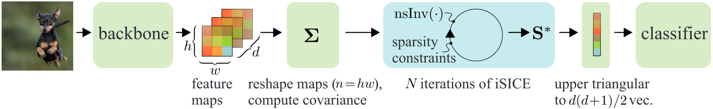

## Learning Partial Correlation based Deep Visual Representation for Image Classification<br><sub>Official implementation with PyTorch</sub>

###  | [Project Website](https://csiro-robotics.github.io/iSICE) 

This repository contains the model definitions, training/evaluation code and pre-trained model weights for our paper exploring partial correlation based deep SPD visual representation. More information are available on our [project website](#).

> <b>Learning Partial Correlation based Deep Visual Representation for Image Classification</b> <br>
> [Saimunur Rahman](#), [Piotr Koniusz](http://users.cecs.anu.edu.au/~koniusz), [Lei Wang](https://sites.google.com/view/lei-hs-wang), [Luping Zhou](https://www.sydney.edu.au/engineering/about/our-people/academic-staff/luping-zhou.html), [Peyman Moghadam](https://people.csiro.au/m/p/peyman-moghadam), [Changming Sun](https://vision-cdc.csiro.au/changming.sun)<br>
> CSIRO Data61, University of Wollongong, University of Sydney

Visual representation based on covariance matrix has demonstrates its efficacy for image classification by characterising the pairwise correlation of different channels in convolutional feature maps. However, pairwise correlation will become misleading once there is another channel correlating with both channels of interest, resulting in the "confounding" effect. For this case, "partial correlation" which removes the confounding effect shall be estimated instead. Nevertheless, reliably estimating partial correlation requires to solve a symmetric positive definite matrix optimisation, known as sparse inverse covariance estimation (SICE). How to incorporate this process into CNN remains an open issue. In this work, we formulate SICE as a novel structured layer of CNN. To ensure the CNN still be end-to-end trainable, we develop an iterative method based on Newton-Schulz iteration to solve the above matrix optimisation during forward and backward propagation steps. Our work not only obtains a partial correlation based deep visual representation but also mitigates the small sample problem frequently encountered by covariance matrix estimation in CNN. Computationally, our model can be effectively trained with GPU and works well with a large number of channels in advanced CNN models. Experimental results confirm the efficacy of the proposed deep visual representation and its superior classification performance to that of its covariance matrix based counterparts.

This repository contains:

:heavy_check_mark: A simple implementation of our method with PyTorch<br>
:heavy_check_mark: A script useful for training/evaluating our method on various datasets<br>
:heavy_check_mark: Pre-trained model weights on several datasets

## Repository Setup Guide
To run our code on your machine, the first step would be repository download which can be done using the following commands:
```bash
cd /the/path/where/you/want/to/copy/the/code
git clone https://github.com/csiro-robotics/iSICE.git
cd iSICE
```
The second step is to create a conda enovironment with necessary python packages which can be done using the following commands:

```bash
conda create -name iSICE
conda install pytorch torchvision cudatoolkit torchaudio scipy matplotlib -c pytorch
```

For easiness of use, we only use common python packages so that users can run our code with less difficulty. If you do not have anaconda installed, you can either install anaconda or its lighter version miniconda, or use python virtual environment. In case of python virtual environment, the packages can be installed with `pip`. Please see [here](https://pip.pypa.io/en/stable/cli/pip_install) for details. We also provided the `isice.yml' file for creating conda environment similar to us.

Note that we have evaluated our code with PyTorch 1.9.0. However, there should not be problem with other versions released after PyTorch 0.4.0. The above command will provide GPU support via CUDA which supports CPU by default.

The third step is to activate the above conda enovironment with the following command:

```bash
conda activate iSICE
```

The forth step will be downloading the datasets. All datasets should be prepared as follows.

```bash
.
├── train
│   ├── class 1
│   │   ├── image_001.format
│   │   ├── image_002.format
|   |   └── ...
│   ├── class 2
│   ├── class 3
│   ├── ...
│   ├── ...
│   └── class N
└── val
    ├── class 1
    │   ├── image_001.format
    │   ├── image_002.format
    |   └── ...
    ├── class 2
    ├── class 3
    ├── ...
    ├── ...
    └── class N
```

## Repository Overview
We use a modular design for this repository. From our experience, we find that such design is easy to manage and extend. Our code repository is segmented as follows.

```bash
├── main.py
├── imagepreprocess.py
├── functions.py
├── model_init.py
├── src
│   ├── network
│   │   ├── __init__.py
│   │   ├── base.py
│   │   ├── inception.py
│   │   ├── alexnet.py
│   │   ├── resnet.py
│   │   └── vgg.py
│   ├── representation
│   │   ├── __init__.py
│   │   ├── SICE.py
│   │   ├── INVCOV.py
│   │   ├── COV.py
│   │   ├── GAvP.py
├── train_iSICE_model.sh
```

## How to use our code
Our `main.py` maintains the process of running our code to reproduce the results reported in the paper. Supppose, we want to train a partial correlation representation model based on VGG-16 backbone with CUB-200 dataset (referred as Birds dataset in the paper) and evaluate on the same dataset, the following command can be used:

```bash
python main.py /path/to/CUB --benchmark CUB --pretrained -a vgg16_bn --epochs 100 --lr 1.2e-4 --lr-method step --lr-params 15\ 30 -j 10 -b 65 --num-classes 200 --representation SICE --freezed-layer 0 --classifier-factor 5 --modeldir /path/to/save/the/model/and/meta/information
```

As training progresses, loss, top-1 error and top-5 error information for both training and test evaluation will be automatically saved in the path specified with `--modeldir` parameter above.

For training on computing clusters such as HPC please use the `train_iSICE_model.sh` script by changing it various fields as per the given instructions on the script (we showed how to train using MIT indoor dataset). Our code is compatible with multiple GPU training.

## Pre-trained models
For convanience, we provide our VGG-16 and ResNet-50 based partial correlation models on traned on fine-grained and scene datasets. They can be downloaded here.

#### Pairwise correlation based models (computed via iSQRT-COV pooling)
<table>
<thead>
  <tr>
    <th></th>
    <th colspan="2"><a href="https://web.mit.edu/torralba/www/indoor.html">MIT</a></th>
    <th colspan="2"><a href="https://www.robots.ox.ac.uk/~vgg/data/fgvc-aircraft/">Airplane</a></th>
    <th colspan="2"><a href="http://www.vision.caltech.edu/datasets/cub_200_2011/">Birds</a></th>
    <th colspan="2"><a href="http://ai.stanford.edu/~jkrause/cars/car_dataset.html">Cars</a></th>
  </tr>
</thead>
<tbody>
  <tr>
    <td>Backbone</td>
    <td>top1 acc. (%)</td>
    <td>Model</td>
    <td>top1 acc. (%)</td>
    <td>Model</td>
    <td>top1 acc. (%)</td>
    <td>Model</td>
    <td>top1 acc. (%)</td>
    <td>Model</td>
  </tr>
  <tr>
    <td>VGG-16</td>
    <td>76.1</td>
    <td>TBA</td>
    <td>90.0</td>
    <td>TBA</td>
    <td>84.5</td>
    <td>TBA</td>
    <td>91.2</td>
    <td>TBA</td>
  </tr>
  <tr>
    <td>ResNet-50</td>
    <td>78.8 </td>
    <td>TBA</td>
    <td>90.9</td>
    <td>TBA</td>
    <td>84.3</td>
    <td>TBA</td>
    <td>92.1</td>
    <td>TBA</td>
  </tr>
</tbody>
</table>

#### Partial correlation based models (computed via Precision Matrix described in Algorithm 1 of the paper)
<table>
<thead>
  <tr>
    <th></th>
    <th colspan="2"><a href="https://web.mit.edu/torralba/www/indoor.html">MIT</a></th>
    <th colspan="2"><a href="https://www.robots.ox.ac.uk/~vgg/data/fgvc-aircraft/">Airplane</a></th>
    <th colspan="2"><a href="http://www.vision.caltech.edu/datasets/cub_200_2011/">Birds</a></th>
    <th colspan="2"><a href="http://ai.stanford.edu/~jkrause/cars/car_dataset.html">Cars</a></th>
  </tr>
</thead>
<tbody>
  <tr>
    <td>Backbone</td>
    <td>top1 acc. (%)</td>
    <td>Model</td>
    <td>top1 acc. (%)</td>
    <td>Model</td>
    <td>top1 acc. (%)</td>
    <td>Model</td>
    <td>top1 acc. (%)</td>
    <td>Model</td>
  </tr>
  <tr>
    <td>VGG-16</td>
    <td>80.2 </td>
    <td>TBA</td>
    <td>89.4 </td>
    <td>TBA</td>
    <td>83.4 </td>
    <td>TBA</td>
    <td>92.0</td>
    <td>TBA</td>
  </tr>
  <tr>
    <td>ResNet-50</td>
    <td>80.8  </td>
    <td>TBA</td>
    <td>91.2  </td>
    <td>TBA</td>
    <td>84.7  </td>
    <td>TBA</td>
    <td>92.0</td>
    <td>TBA</td>
  </tr>
</tbody>
</table>

#### Partial correlation based models (computed via iSICE described in Algorithm 2 of the paper)
<table>
<thead>
  <tr>
    <th></th>
    <th colspan="2"><a href="https://web.mit.edu/torralba/www/indoor.html">MIT</a></th>
    <th colspan="2"><a href="https://www.robots.ox.ac.uk/~vgg/data/fgvc-aircraft/">Airplane</a></th>
    <th colspan="2"><a href="http://www.vision.caltech.edu/datasets/cub_200_2011/">Birds</a></th>
    <th colspan="2"><a href="http://ai.stanford.edu/~jkrause/cars/car_dataset.html">Cars</a></th>
  </tr>
</thead>
<tbody>
  <tr>
    <td>Backbone</td>
    <td>top1 acc. (%)</td>
    <td>Model</td>
    <td>top1 acc. (%)</td>
    <td>Model</td>
    <td>top1 acc. (%)</td>
    <td>Model</td>
    <td>top1 acc. (%)</td>
    <td>Model</td>
  </tr>
  <tr>
    <td>VGG-16</td>
    <td>78.7  </td>
    <td>TBA</td>
    <td>92.2  </td>
    <td>TBA</td>
    <td>86.5  </td>
    <td>TBA</td>
    <td>94.0</td>
    <td>TBA</td>
  </tr>
  <tr>
    <td>ResNet-50</td>
    <td>80.5  </td>
    <td>TBA</td>
    <td>92.7   </td>
    <td>TBA</td>
    <td>85.9   </td>
    <td>TBA</td>
    <td>93.5</td>
    <td>TBA</td>
  </tr>
</tbody>
</table>

Pre-trained models canbe used as a checkpoints for further training/evaluation using the following command:

```bash
python main.py /path/to/CUB --benchmark CUB --pretrained -a vgg16_bn --epochs 100 --lr 1.2e-4 --lr-method step --lr-params 15\ 30 -j 10 -b 65 --num-classes 200 --representation SICE --freezed-layer 0 --classifier-factor 5 --resume /path/to/downloaded/model
```

## How to cite our paper
Please use the following bibtex reference to cite our paper.
```bibtex
@InProceedings{isice_cvpr,
    author = {Rahman, Saimunur and Koniusz, Piotr and Wang, Lei and Zhou, Luping and Moghadam, Peyman and Sun, Changming},
    title = {Learning Partial Correlation based Deep Visual Representation for Image Classification},
    booktitle = {IEEE/CVF Int. Conf. on Computer Vision and Pattern Recognition (CVPR)},
    month = {June},
    year = {2023}
}
```

## Acknowledgments

This codebase borrows from [iSQRT-COV repository](https://github.com/jiangtaoxie/fast-MPN-COV), we thank the authors for maintaining the repository.

## Contact
If you have any questions or suggestions, please contact `saimun.rahman@data61.csiro.au`.

